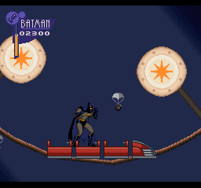
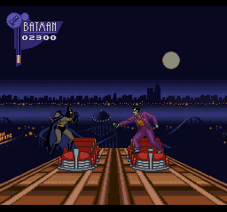
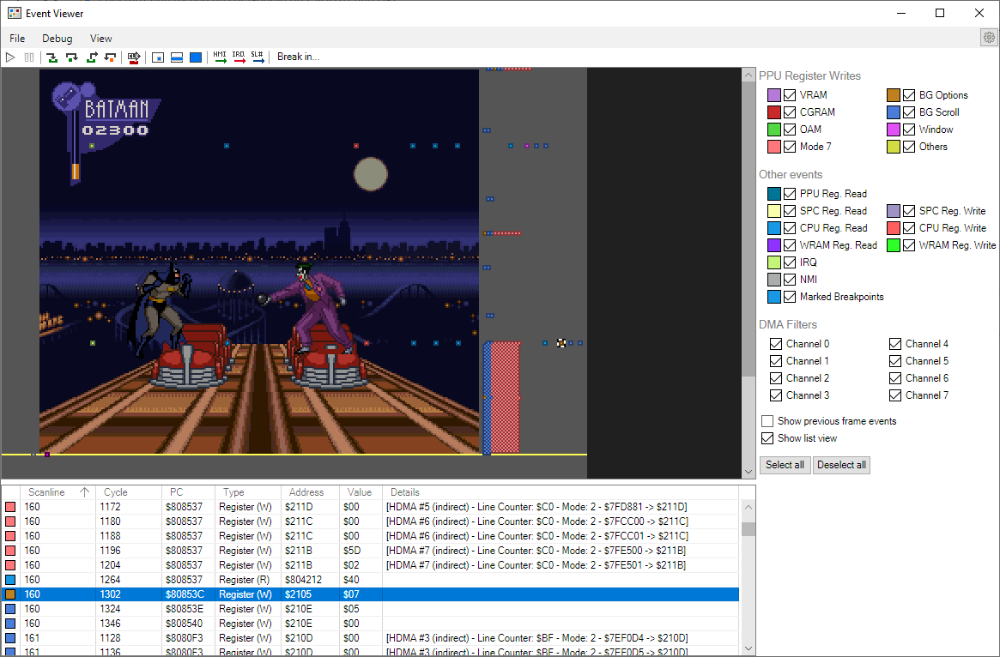

# Does this SNES game use Mode 7?

As there is a lot of misconceptions surrounding the infamous mode 7 of the Super Nintendo, this page is intended to show what background mode is used in various games.

## The Adventures of Batman & Robin - Roller Coaster Level

This level uses the mode 7 twice.

### Loop section

For the loop section of the track, the whole screen is in mode 7. 

### Front section

The top part of the screen (scanlines 0 to 159) uses mode 1, like the rest of the level. \
The bottom part of the screen (scanlines 160 and on) uses mode 7.

The change from mode 1 to mode 7 is done with HDMA on scanline 160 as shown here (Register $2105 controls the background mode).

